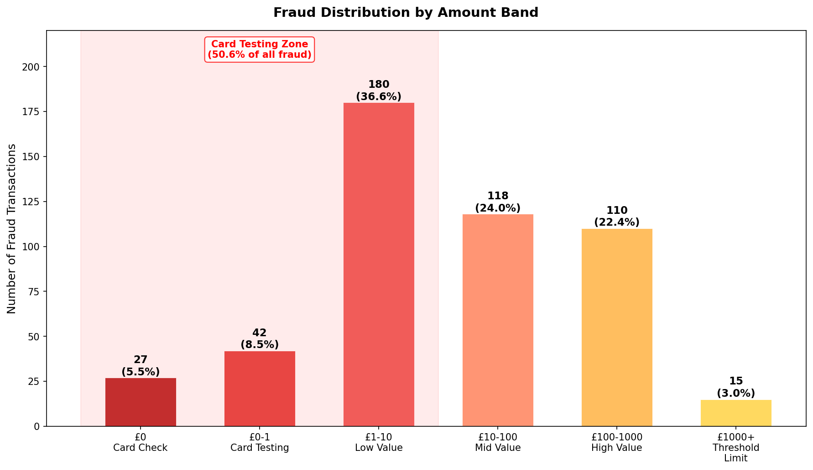
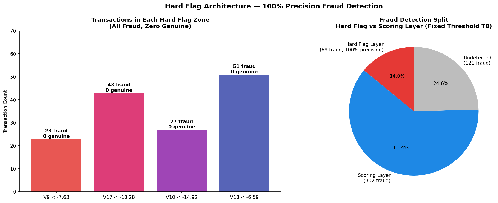
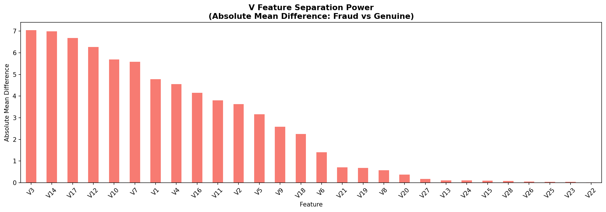
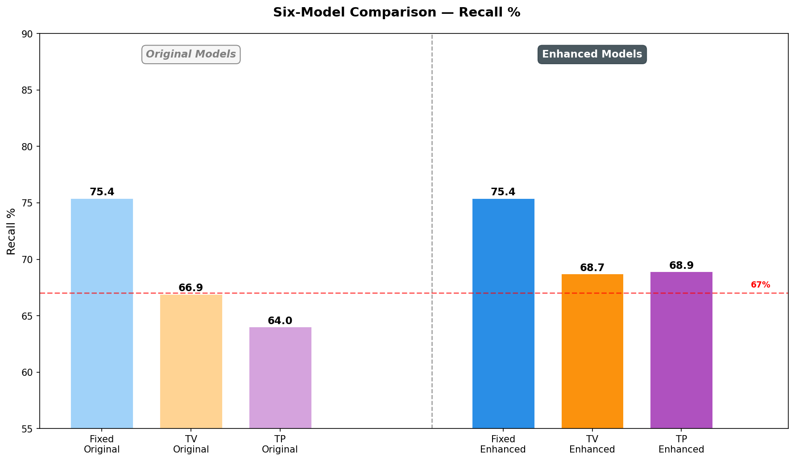
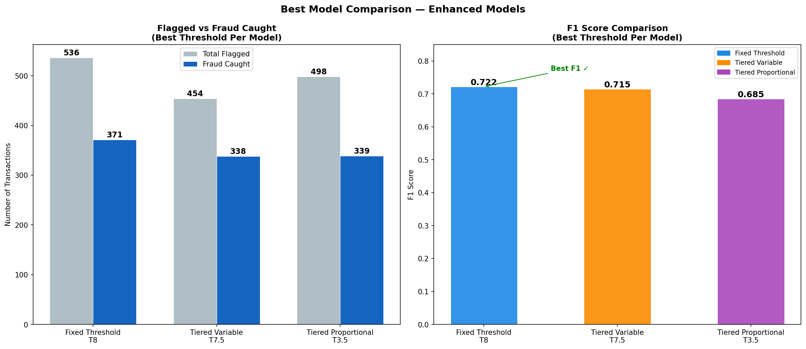
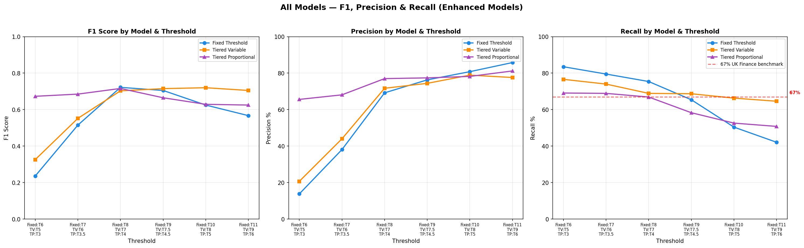
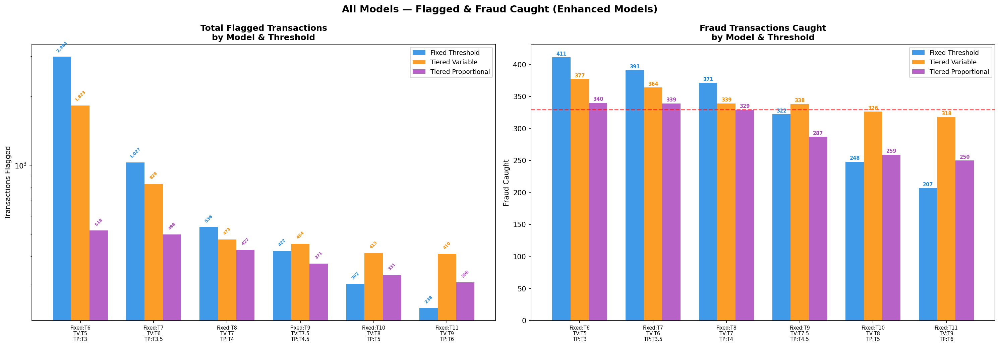
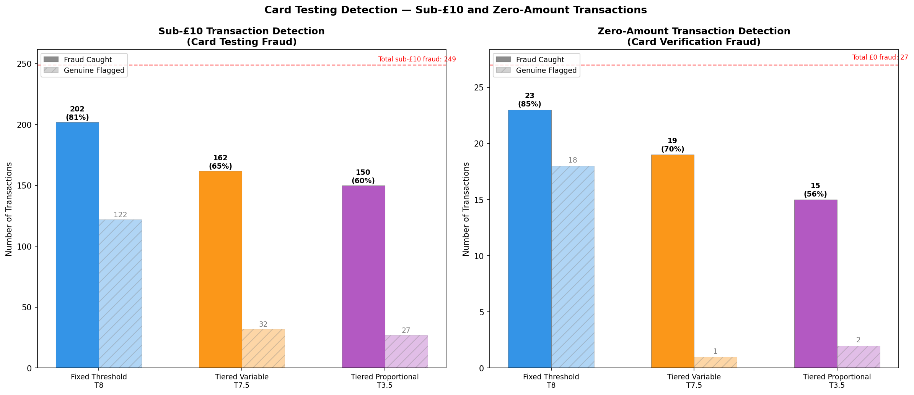

# Credit Card Fraud Pattern Analysis: A Detection-Led Approach

**Peter Francis Muthukkalai** | Google Data Analytics Professional Certificate Portfolio | April 2026

---

## Project Overview

This project applies fraud domain knowledge to a real-world anonymised transaction dataset, building and systematically enhancing three rule-based fraud detection models. The analysis progresses through four phases — SQL data ingestion, Python EDA, model development, and Power BI dashboarding — resulting in all three enhanced models exceeding the UK Finance 2024 industry benchmark of 67% fraud prevention recall.

**Dataset:** [Worldline/ULB Credit Card Fraud Detection](https://www.kaggle.com/datasets/mlg-ulb/creditcardfraud) — 284,807 transactions, 492 fraud cases (0.17% fraud rate), features V1–V28 (PCA-anonymised), Amount, Time, Class.

---

## Final Model Results

All three enhanced models exceed the UK Finance 2024 benchmark of 67% recall:

| Model | Threshold | Fraud Caught | Flagged | Recall % | Precision % | F1 Score |
|---|---|---|---|---|---|---|
| Fixed Threshold | T8 | 371 | 536 | 75.4% | 69.2% | 0.722 |
| Tiered Variable | T7.5 | 338 | 454 | 68.7% | 74.4% | 0.715 |
| Tiered Proportional | T3.5 | 339 | 498 | 68.9% | 68.1% | 0.685 |

---

## Deliverables

- **[Power BI Dashboard (PDF)](pdf/Credit_Card_Fraud_Analysis_BI.pdf)** — Three-page interactive dashboard covering executive summary, fraud pattern analysis, and model performance comparison
- **[Full Project Report (PDF)](pdf/Credit_Card_Fraud_Analysis_Report.pdf)** — Detailed report covering all four phases, enhancement methodology, and operational detection rules
- **[SQL Queries](sql/)** — Five BigQuery quality check queries (P1_Q01 to P1_Q05)
- **[Charts](charts/)** — Complete chart library from Phase 2 EDA and Phase 3 model analysis

---

## Key Findings

**Card Testing Behaviour:** 50.6% of all fraud falls under £10, with zero-amount transactions occurring at 9x the rate of genuine transactions. These patterns are consistent with BIN attack sequences where fraudsters test stolen card details before attempting higher-value purchases.

**Overnight Fraud Elevation:** The 2am fraud rate reaches 1.70% — approximately 10x the daily average of 0.17% — confirming overnight timing as a reliable secondary detection signal.

**Hard Flag Architecture:** Four V features (V9, V17, V10, V18) exhibit 100% fraud rates at extreme values with zero genuine transactions across a combined 144 band occurrences. These were implemented as hard flags — automatic alerts that bypass the scoring engine entirely — catching 69 fraud transactions at 100% precision.

**V Feature Independence:** Near-zero inter-correlation between the top fraud-separating features (V3, V14, V17, V12, V10) confirms that each adds genuinely independent signal to the scoring model.

---

## Model Architecture

Three detection models were built, each using a different V feature scoring methodology. The Fixed Threshold model uses binary rules with fixed points. The Tiered Variable model assigns points by fraud rate bracket across five bands per feature. The Tiered Proportional model scales points continuously by actual fraud rate, producing finer discrimination between bands.

All three models were enhanced in a second phase: the Fixed Threshold model gained a two-layer hard flag and scoring architecture with V3 stepped extreme rules; the Tiered Variable and Tiered Proportional models gained scaled Amount and Time rules calibrated proportionally to each model's threshold.

---

## Phase Summary

**Phase 1 — SQL Data Ingestion and Quality Checks (BigQuery)**
Five queries confirmed zero nulls, identified duplicate BIN attack patterns with 100% fraud rates, and established that fraud averages £122 versus £88 for genuine transactions — confirming threshold avoidance behaviour.

**Phase 2 — Python EDA and Fraud Pattern Analysis (Google Colab)**
Exploratory analysis confirmed card testing velocity patterns, overnight fraud elevation, and identified V3, V14, V17, V12, and V10 as the strongest fraud-separating features.

**Phase 3 — Fraud Profiling and Detection Models**
Three rule-based scoring models were built and evaluated. A systematic enhancement investigation explored hard flag candidates across all 28 V features, pairwise combinations, and Amount combined with V feature signals. Four zero-genuine extreme zones were identified and implemented as hard flags. Scaled Amount and Time rules were added to the tiered models, pushing all three above the 67% UK Finance benchmark.

**Phase 4 — Power BI Dashboard**
Three-page dashboard covering executive KPIs, fraud pattern analysis, and six-model performance comparison with UK Finance benchmark reference line.

---

## Sub-£10 and Zero-Amount Detection

Card testing fraud — transactions under £10 and zero-amount transactions — represents 50.6% of all fraud. The chart below shows how each enhanced model detects this population, illustrating the trade-off between detection rate and false positive volume.

---

## Tools and Infrastructure

| Component | Detail |
|---|---|
| SQL | Google BigQuery — fraud-analytics-project1 |
| Python | Google Colab — pandas, matplotlib, seaborn, scikit-learn |
| Visualisation | Power BI Desktop |
| Cloud Storage | Google Cloud Storage — europe-west2 |
| Dataset Source | Kaggle — Worldline/ULB Credit Card Fraud Detection |

---

## Dataset Note

The Worldline/ULB dataset does not explicitly confirm Card Not Present (CNP) transaction type. The CNP assumption is informed by zero-amount card verification patterns, small-amount velocity bursts consistent with BIN attacks, and the absence of location and merchant data consistent with PCA anonymisation of CNP metadata. All CNP references in the analysis are labelled as informed assumptions rather than confirmed data attributes.

---

*Google Data Analytics Professional Certificate Portfolio — April 2026*
